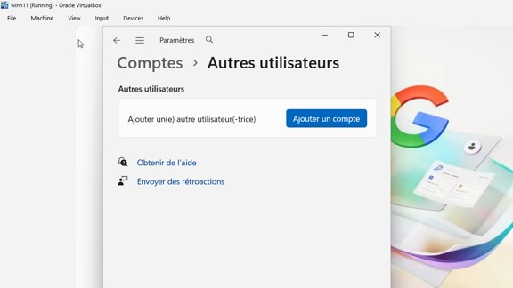

# Lab-configuration-pare-feu-Windows
Laboratoire de configuration d’un pare-feu Windows

Introduction

Ce laboratoire vise à démontrer le fonctionnement du pare-feu Windows à travers la création d’une règle de filtrage du trafic DNS. L’objectif est d’observer l’impact d’une restriction réseau sur la résolution des noms de domaine et sur la connectivité vers un site web donné.

Objectif

L’objectif principal est de bloquer les flux DNS entrants et sortants en configurant une règle dans le pare-feu Windows. Cette manipulation permet de comprendre comment une politique de sécurité peut influencer la communication entre une machine et un serveur DNS.
Rappel théorique
Le DNS, ou Domain Name System, est un service essentiel du réseau qui permet de traduire un nom de domaine en adresse IP. Il utilise principalement le port 53 en UDP, et dans certains cas le port 53 en TCP, notamment pour des transferts de zone ou lorsque la réponse dépasse la capacité standard d’un paquet UDP.
Sans DNS, un poste de travail peut avoir de la difficulté à résoudre les noms de domaine, même si la connectivité IP reste active. Cela explique pourquoi le blocage du port DNS a un effet direct sur l’accès aux ressources web par nom de domaine.
Environnement

Le laboratoire a été réalisé sur une machine virtuelle Windows. L’utilisation d’une VM permet d’effectuer les tests en toute sécurité, sans compromettre l’environnement principal.

**Déroulement du laboratoire** 

 

-	On Crée une règle au niveau du pare-feu pour bloquer le flux DNS
Rappel : 
DNS (Domain Name System)
Il a pour port par défaut le port : 53, avec Protocol UDP, TCP 
Lorsqu’un utilisateur effectue une requête DNS en accédant à une adresse web vers le serveur DNS sur le port 53 UDP. 
En retour il y’a la réponse avec l'adresse IP de l’adresse web en question.
Dans le cas où la réponse dépasse 512 octets ou pour le transfert de zone entre serveurs, DNS utilise TCP sur le port 53.

1.	On Créer une règle de pare-feu Windows pour bloquer le trafic DNS.
 

  

1.	On Créer une règle de pare-feu Windows pour bloquer l’accès à un site Instagram au poste.

 

On Observer les effets de cette règle sur la résolution du nom de domaine.

Bloquer un trafic sortant : sur Instagram

NSLOOKUP :  trouver ladresse IP du site à limiter l’accès 
 
 

 

1.	Ouvrir l’invite de commandes Windows.
2.	Effectuer un premier test de connectivité avec la commande :
ping quebec.ca
 
3.	Vider le cache DNS avec la commande :
ipconfig /flushdns
4.	Refaire un ping vers quebec.ca afin de vérifier le comportement après la suppression du cache. 
 

Observations

Avant l’application de la règle, la machine parvient à résoudre le nom de domaine et à communiquer avec quebec.ca. Après le vidage du cache DNS, une nouvelle résolution est effectuée, ce qui permet de vérifier le rôle du service DNS dans l’accès au site.
Une fois la règle de pare-feu appliquée, le trafic DNS est bloqué, ce qui perturbe la résolution des noms de domaine. Lorsque la règle est désactivée, le comportement normal est rétabli, confirmant que le blocage du port 53 a bien eu un effet sur la communication réseau.

Analyse

Cette expérience démontre l’importance du DNS dans le fonctionnement d’Internet et met en évidence le rôle du pare-feu dans le contrôle du trafic réseau. En bloquant un service aussi fondamental, on observe rapidement l’impact d’une mesure de sécurité sur l’accessibilité aux ressources web.
Le laboratoire illustre aussi l’utilité des règles de pare-feu pour la gestion fine des communications réseau. Dans un contexte professionnel, ce type de configuration peut servir à renforcer la sécurité, à limiter certains flux ou à tester la résilience d’un environnement informatique.

Conclusion
Ce laboratoire a permis de configurer et de valider une règle de pare-feu Windows visant à bloquer le trafic DNS. L’exercice a montré de façon concrète le lien entre la résolution des noms de domaine, la connectivité réseau et les mécanismes de filtrage de sécurité.

Ce laboratoire avait pour objectif de démontrer l’impact d’une règle de pare-feu Windows sur le trafic DNS. À travers différentes manipulations, il a été possible d’observer que le blocage du port 53 perturbe la résolution des noms de domaine et, par conséquent, l’accès aux ressources web. Cette activité a permis de mieux comprendre le rôle du pare-feu dans la sécurisation d’un poste de travail et dans la gestion du trafic réseau un style encore plus naturel.

